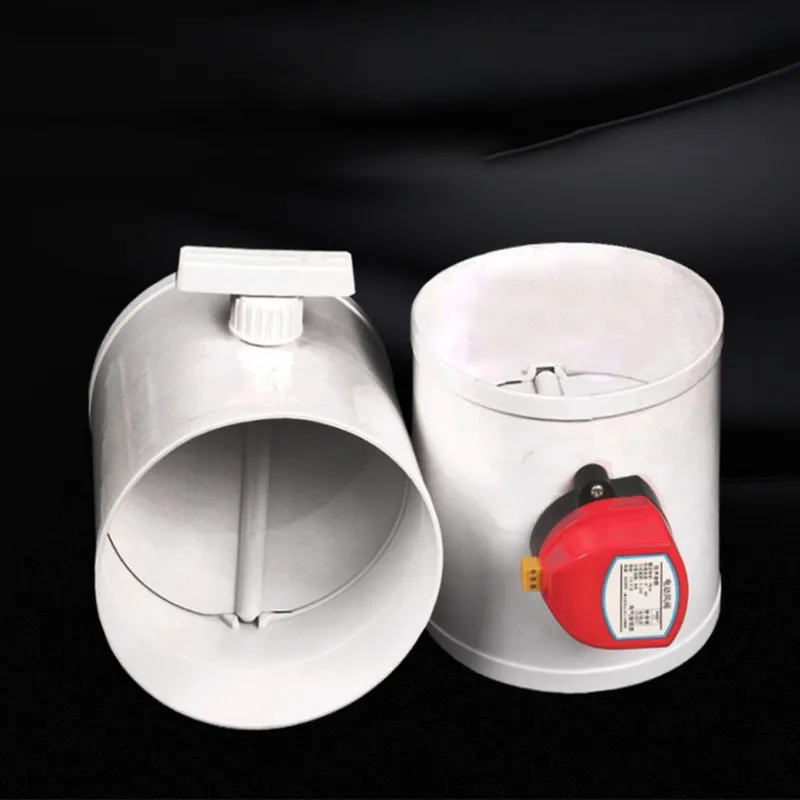
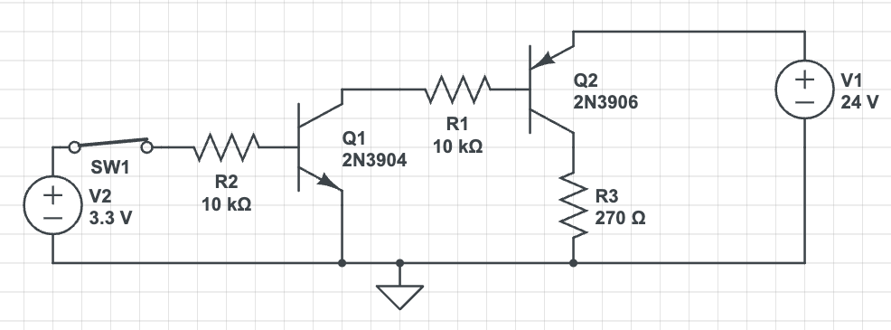

# Zone Damper
This project is a controller for a 24v motorized zone damper (see image). 
It uses an ESP32-S2 as a controller, and provides a web user interface.
The control interface can be reached at: http://zone_damper.local on the local network, but using a static IP is a good option.
A cheap 24V DC motor from AliExpress will actuate a manual zone damper.
Each direction (Open & Close) is controlled by a NPN/PNP transistor pair since the motor uses a common ground configuration.

The R3 represents the motor.

### Installation 
0° should be closed, so we need to make sure that when the to mount the horizontal position as closed.
90° is vertical and should be open.

